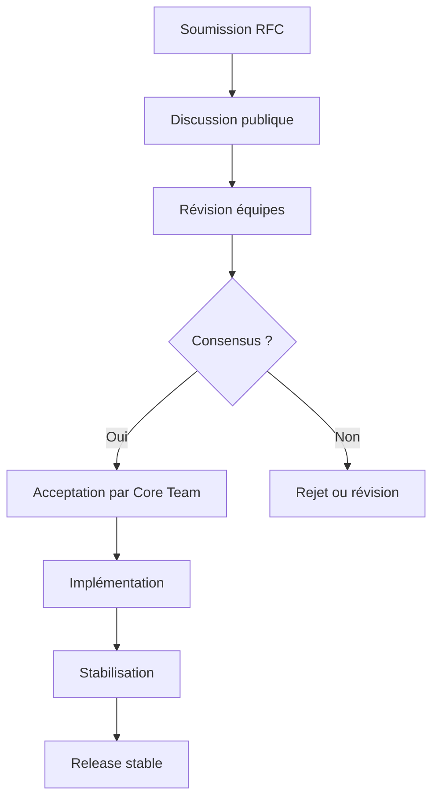

# RFC 0020 — Governance and Evolution Process

## Résumé
Ce RFC définit le processus de **gouvernance** et d’**évolution** du langage **Vitte**.  
Il décrit comment les décisions sont prises, comment les RFC sont proposées et acceptées, et comment la communauté participe à l’évolution du langage.

## Motivation
Un langage sans gouvernance claire court le risque de :  
- fragmentation et forks concurrents,  
- décisions arbitraires et manque de transparence,  
- perte de confiance des développeurs et entreprises.  

Un processus de gouvernance bien défini assure :  
- transparence et légitimité des décisions,  
- implication de la communauté,  
- équilibre entre innovation et stabilité,  
- évolution ordonnée du langage et de son écosystème.  

## Design proposé

### Structure de gouvernance
- **Core Team** : responsables finaux de la direction du langage.  
- **Libs Team** : responsable de la bibliothèque standard.  
- **Compiler Team** : responsable du compilateur et de la VM.  
- **Tools Team** : responsable des outils (`vitpm`, `vitfmt`, `vitlint`, etc.).  
- **Community WG** : anime la communauté, propose des améliorations.  

### Processus RFC
1. **Proposition** : un contributeur soumet un fichier `xxxx-nom.md` dans le dépôt `rfcs/`.  
2. **Discussion** : ouverte publiquement (GitHub, forum, chat).  
3. **Révision** : les équipes concernées commentent et demandent des modifications.  
4. **Acceptation ou rejet** : décision prise par le **Core Team** après consensus.  
5. **Implémentation** : l’auteur ou une équipe s’en charge.  
6. **Stabilisation** : la fonctionnalité passe par une phase expérimentale avant d’être intégrée en stable.  

### Numérotation
- RFC numérotés séquentiellement (`0000-template.md`, `0001-core-syntax.md`, …).  
- Chaque RFC doit être concis, structuré et complet.  

### Transparence
- Toutes les discussions et décisions sont publiques.  
- Votes et décisions documentés dans un changelog de gouvernance.  

### Exemple de workflow RFC

### Évolution du langage
- Changements majeurs doivent passer par RFC.  
- Dépréciations planifiées avec période de transition.  
- Versions stables publiées régulièrement.  
- Éditions majeures tous les 2-3 ans (similaire à Rust Editions).  

### Communication
- Blog officiel pour annonces.  
- Réunions régulières (publiques, enregistrées).  
- Forum et discussions ouvertes sur Discord/Matrix.  

## Alternatives considérées
- **Pas de RFC, décisions ad hoc** : rejeté pour manque de transparence.  
- **Leadership unique** : rejeté car risque de dérive autoritaire.  
- **Vote communautaire pur** : rejeté car difficilement efficace à grande échelle.  

## Impact et compatibilité
- Impact fort : cadre clair pour l’évolution.  
- Renforce la confiance des utilisateurs et entreprises.  
- Compatible avec un écosystème open source mature.  
- Introduit une organisation légère mais nécessaire.  

## Références
- [Rust RFC Process](https://github.com/rust-lang/rfcs)  
- [Python PEP Process](https://peps.python.org/)  
- [Go Proposal Process](https://github.com/golang/proposal)  
