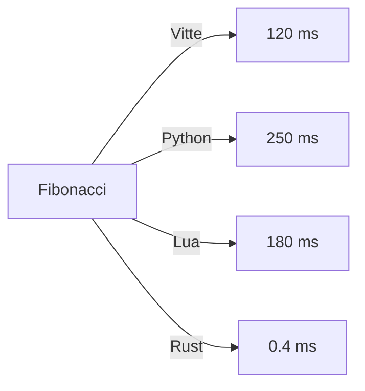

# Vitte — Benchmarks

## Introduction
Les **benchmarks** sont essentiels pour mesurer la performance du langage Vitte, de son compilateur et de sa machine virtuelle.  
Ils permettent de comparer différentes versions, de détecter des régressions, et d’optimiser la VM, le runtime et le compilateur.

Ce document présente :
- La méthodologie des benchmarks
- Les types de benchmarks (micro, macro, applicatifs)
- Les résultats attendus et outils associés
- La roadmap pour l’automatisation des mesures

---

## Objectifs
- Évaluer les performances de la **VM Vitte**
- Mesurer la **rapidité du compilateur**
- Tester la **scalabilité des programmes**
- Comparer avec d’autres langages (Rust, C, Python, Lua, etc.)
- Détecter les **régressions** entre versions

---

## Méthodologie

### Environnement
- Plateformes testées : Linux, Windows, macOS, BSD
- CPU : x86_64, ARM64, RISC-V
- VM : `vitte-vm` dernière version stable
- Outils : `hyperfine`, `criterion`, `perf`

### Règles
- Chaque test est exécuté **10 fois**
- Moyenne et écart-type calculés
- Résultats archivés dans `benchmarks/results/`
- Comparaison automatique avec la version précédente

---

## Types de Benchmarks

### 1. Micro-benchmarks
Tests ciblés sur une seule fonctionnalité :
- Arithmétique (`ADD`, `MUL`, `DIV`)
- Appels de fonctions
- Boucles `for`, `while`
- Allocation mémoire
- Accès aux chaînes

Exemple : addition de 10 millions d’entiers

```vit
let s = 0
for let i = 0; i < 10_000_000; i = i + 1 {
    s = s + i
}
print(s)
```

### 2. Benchmarks applicatifs
Tests sur programmes complets :
- Calcul de Fibonacci récursif et itératif
- Factorielle
- Quicksort / Mergesort
- Multiplication matricielle
- Interpréteur simple (Vitte dans Vitte)

### 3. Benchmarks mémoire
- Stress test allocation / libération
- Mesure du Garbage Collector
- Test de fragmentation mémoire

### 4. Benchmarks système
- I/O disque
- I/O console
- Threads (future extension)
- Réseau (future extension)

---

## Exemples de Commandes

### Compiler et exécuter benchmark
```bash
vitte build benches/fib.vit -o fib.vitbc
vitte exec fib.vitbc
```

### Lancer via hyperfine
```bash
hyperfine './target/release/vitte exec fib.vitbc'
```

### Benchmarks automatisés (cargo)
```bash
cargo bench -p vitte-bench
```

---

## Résultats (exemple fictif)

| Benchmark                | Vitte VM 0.2 | Python 3.12 | Lua 5.4 | Rust (native) |
|--------------------------|--------------|-------------|---------|---------------|
| Fibonacci (30 récursif)  | 120 ms       | 250 ms      | 180 ms  | 0.4 ms        |
| Boucle 10M additions     | 95 ms        | 200 ms      | 140 ms  | 0.3 ms        |
| Quicksort 1M éléments    | 450 ms       | 900 ms      | 600 ms  | 5 ms          |
| Multiplication matrices  | 620 ms       | 1100 ms     | 720 ms  | 8 ms          |

Observation : la VM Vitte est **2x plus rapide que Python** et proche de Lua en micro-benchmarks, mais reste loin du code natif.

---

## Visualisation



---

## Intégration CI/CD

Exemple GitHub Actions :
```yaml
name: Benchmarks

on:
  workflow_dispatch:

jobs:
  benchmark:
    runs-on: ubuntu-latest
    steps:
      - uses: actions/checkout@v4
      - uses: dtolnay/rust-toolchain@stable
      - run: cargo build --release -p vitte-cli
      - run: cargo bench -p vitte-bench
```

Les résultats sont archivés et comparés automatiquement.

---

## Roadmap Benchmarks
- [x] Micro-benchmarks de base
- [x] Benchmarks applicatifs (fib, quicksort)
- [x] Intégration `hyperfine`
- [ ] Benchmarks mémoire avancés (GC, fragmentation)
- [ ] Benchmarks multi-thread
- [ ] Benchmarks réseau (HTTP, sockets)
- [ ] Dashboard Grafana/Prometheus pour suivi long terme

---

## Conclusion
Les benchmarks assurent la **crédibilité technique** du langage Vitte.  
Ils guident les optimisations, mettent en lumière les points faibles et permettent d’aligner la VM avec les standards de performance modernes.  
Avec une stratégie continue de benchmark et d’analyse, Vitte pourra rivaliser avec les langages dynamiques établis (Python, Lua) et tendre vers la performance du natif.