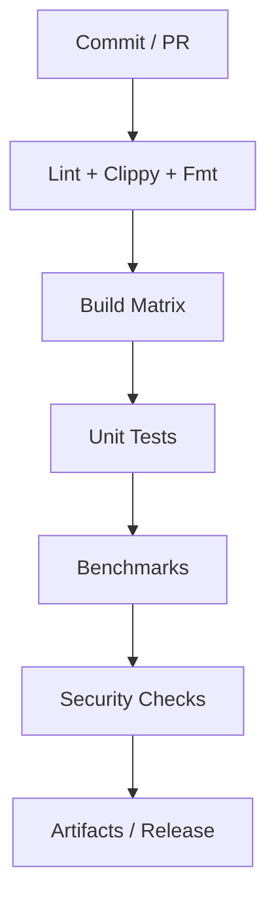

# Vitte — Continuous Integration (CI)

## Introduction
La **CI (Continuous Integration)** de Vitte garantit la qualité, la stabilité et la portabilité du projet.  
Chaque commit déclenche une série de jobs automatisés : compilation, tests, benchmarks, lint, sécurité et packaging.

---

## Objectifs
- Valider que le code compile sur toutes les plateformes supportées
- Empêcher les régressions via tests et benchmarks
- Fournir un retour rapide aux contributeurs
- Générer automatiquement les artefacts de release
- Préparer la livraison sur divers gestionnaires de paquets

---

## Plateformes Ciblées
- **Linux** : Ubuntu, Debian, Fedora, Arch
- **Windows** : MSVC, MinGW
- **macOS** : Intel, Apple Silicon
- **BSD** : FreeBSD, OpenBSD
- **Cross-compilation** : RISC-V, ARM (Raspberry Pi), WebAssembly/WASI

---

## Workflow Global



---

## Exemple GitHub Actions — CI

```yaml
name: CI

on:
  push:
    branches: [ main ]
    paths-ignore:
      - "docs/**"
      - "**/*.md"
      - ".vscode/**"
  pull_request:
  workflow_dispatch:

concurrency:
  group: ci-${{ github.ref }}
  cancel-in-progress: true

env:
  CARGO_TERM_COLOR: always
  RUSTFLAGS: -Dwarnings

jobs:
  lint:
    name: fmt + clippy + deny (ubuntu)
    runs-on: ubuntu-latest
    steps:
      - uses: actions/checkout@v4
      - uses: dtolnay/rust-toolchain@stable
        with:
          components: rustfmt, clippy
      - run: cargo fmt --all -- --check
      - run: cargo clippy --all-targets --all-features -- -D warnings

  build:
    name: build + test (matrix)
    runs-on: ${{ matrix.os }}
    strategy:
      matrix:
        os: [ubuntu-latest, macos-latest, windows-latest]
    steps:
      - uses: actions/checkout@v4
      - uses: dtolnay/rust-toolchain@stable
      - run: cargo build --workspace --release
      - run: cargo test --workspace

  security:
    name: audit + outdated
    runs-on: ubuntu-latest
    steps:
      - uses: actions/checkout@v4
      - run: cargo install cargo-audit --locked
      - run: cargo audit
      - run: cargo install cargo-outdated --locked
      - run: cargo outdated || true

  benchmarks:
    name: run benchmarks
    runs-on: ubuntu-latest
    steps:
      - uses: actions/checkout@v4
      - uses: dtolnay/rust-toolchain@stable
      - run: cargo bench --workspace
```

---

## Exemple GitHub Actions — Release

```yaml
name: Release

on:
  push:
    tags:
      - "v*.*.*"

jobs:
  release:
    runs-on: ubuntu-latest
    steps:
      - uses: actions/checkout@v4
      - uses: dtolnay/rust-toolchain@stable
      - run: cargo build --release --workspace
      - run: cargo test --release --workspace
      - name: Upload artifacts
        uses: actions/upload-artifact@v4
        with:
          name: vitte-binaries
          path: target/release/*
```

---

## Extensions futures
- [ ] Intégration avec **GitLab CI**
- [ ] Builds **Docker** automatiques
- [ ] Tests de **performance comparative** (CI + Grafana)
- [ ] Pipeline **CD (Continuous Delivery)** vers crates.io et Homebrew
- [ ] Sandbox QEMU pour **RISC-V / ARM**

---

## Conclusion
La CI de Vitte est conçue pour être **robuste, portable et évolutive**.  
Elle s’intègre directement avec GitHub Actions, et sera étendue à d’autres plateformes pour garantir la fiabilité du projet sur le long terme.