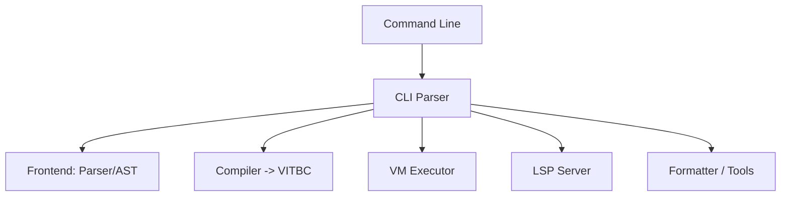

# Vitte CLI — Guide Complet

## Introduction
Le **CLI Vitte** (`vitte-cli`) est l’interface en ligne de commande officielle du langage **Vitte**.  
Il permet de compiler, exécuter, tester et manipuler du bytecode `.vitbc`, ainsi que d’interagir avec l’écosystème (LSP, VM, packaging, etc.).

Objectifs principaux :
- Fournir une interface simple et puissante
- Faciliter le développement, le debug et la distribution
- Être portable sur tous les OS supportés (Linux, Windows, macOS, BSD, etc.)

---

## Installation

### Depuis les sources
```bash
git clone https://github.com/vitte-lang/vitte.git
cd vitte
cargo build --release -p vitte-cli
```

### Utilisation directe
```bash
./target/release/vitte --help
```

### Via gestionnaires de paquets (prévu)
- **Linux** : `apt install vitte-cli` / `dnf install vitte-cli`
- **macOS** : `brew install vitte`
- **Windows** : `scoop install vitte`

---

## Commandes Principales

### `vitte run`
Exécuter un fichier source Vitte directement.
```bash
vitte run hello.vit
```
- Compile en mémoire puis exécute sur la VM.
- Options :
  - `--dump-ir` : affiche l’IR générée
  - `--dump-bc` : affiche le bytecode produit
  - `--release` : active les optimisations

---

### `vitte build`
Compiler un projet en bytecode `.vitbc`.
```bash
vitte build main.vit -o main.vitbc
```
- Options :
  - `-o <file>` : spécifie la sortie
  - `--no-opt` : désactive les optimisations
  - `--zstd` : compresse le bytecode
  - `--emit-ast` : sauvegarde l’AST dans un fichier `.ast.json`

---

### `vitte exec`
Exécuter un fichier bytecode `.vitbc`.
```bash
vitte exec program.vitbc
```
- Vérifie CRC32 et décompresse si nécessaire
- Lance la VM

---

### `vitte repl`
Démarrer un REPL interactif.
```bash
vitte repl
```
- Supporte l’exécution ligne par ligne
- Historique des commandes
- Mode debug : inspection de la pile, des registres, des variables

---

### `vitte check`
Analyser sans exécuter.
```bash
vitte check module.vit
```
- Vérifie la syntaxe
- Vérifie la cohérence de l’AST
- Ne génère pas de bytecode

---

### `vitte fmt`
Formater le code source selon les règles Vitte.
```bash
vitte fmt src/
```
- Utilise le formateur officiel (`vitte-fmt`)
- Options :
  - `--check` : vérifie si le code est déjà formaté
  - `--diff` : affiche les changements sans modifier les fichiers

---

### `vitte lsp`
Lancer le serveur LSP intégré.
```bash
vitte lsp
```
- Sert de backend pour les éditeurs
- Fonctionnalités : diagnostics, autocomplétion, hover, go-to-definition

---

### `vitte test`
Exécuter les tests.
```bash
vitte test
```
- Découvre automatiquement les fichiers `*_test.vit`
- Exécute en sandbox
- Affiche rapport détaillé

---

### `vitte fuzz`
Lancer des campagnes de fuzzing.
```bash
vitte fuzz ./examples/
```
- Génère des inputs aléatoires pour tester la robustesse
- Détecte crashs, comportements indéfinis, lenteurs

---

### `vitte pkg`
Gestion de paquets (prévu).
```bash
vitte pkg add vitte-json
vitte pkg update
vitte pkg publish
```
- Inspiré de Cargo/NPM
- Centralise les modules Vitte

---

## Options Globales

```bash
-v, --version   Affiche la version
-h, --help      Affiche l’aide
--color <when>  Force la couleur [auto|always|never]
--log <level>   Niveau de log [trace|debug|info|warn|error]
```

---

## Exemples de Workflows

### Hello World
```bash
echo 'print("Hello, world!")' > hello.vit
vitte run hello.vit
```

### Compilation + Exécution
```bash
vitte build main.vit -o main.vitbc
vitte exec main.vitbc
```

### Debug d’un programme
```bash
vitte run buggy.vit --dump-ir --dump-bc --log debug
```

### Lancer un REPL
```bash
vitte repl --log trace
```

---

## Architecture du CLI



---

## Intégration CI/CD

Exemple GitHub Actions :
```yaml
name: CI

on:
  push:
    branches: [ main ]
  pull_request:

jobs:
  build:
    runs-on: ubuntu-latest
    steps:
      - uses: actions/checkout@v4
      - uses: dtolnay/rust-toolchain@stable
      - run: cargo build --release -p vitte-cli
      - run: cargo test -p vitte-cli
```

---

## Roadmap CLI
- [x] `run`, `build`, `exec`, `check`, `fmt`
- [x] `repl` interactif
- [x] LSP intégré
- [ ] `pkg` pour gestion des dépendances
- [ ] Cross-compilation automatique
- [ ] Plugins CLI personnalisés

---

## Conclusion
Le **CLI Vitte** est l’outil central pour travailler efficacement avec le langage.  
Il combine **compilation, exécution, test, packaging et tooling moderne** dans un seul binaire léger, cross-platform et extensible.