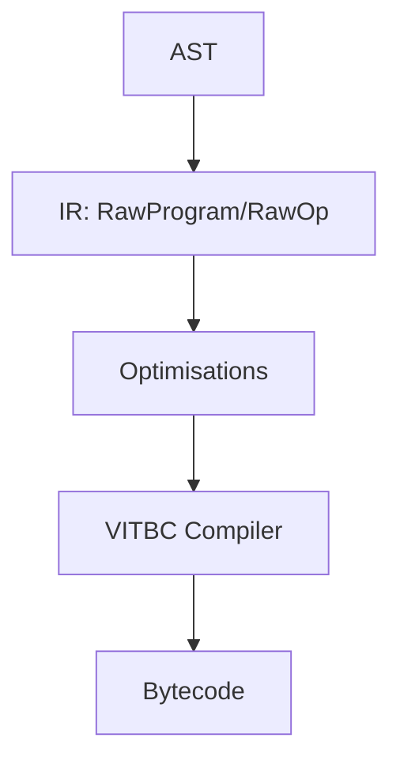

# Vitte — Intermediate Representation (IR)

## Introduction
L’**IR (Intermediate Representation)** de Vitte est la couche intermédiaire entre le parsing (AST) et la génération de bytecode (VITBC).  
Elle fournit une représentation abstraite mais proche de la machine, permettant des optimisations, des transformations et un passage clair vers l’exécution.

---

## Objectifs de l’IR
- Servir de **pont** entre la syntaxe haut niveau (AST) et le bytecode bas niveau.
- Permettre des **optimisations** indépendantes du frontend et du backend.
- Faciliter le **debug** et la visualisation du code.
- Offrir une **stabilité** pour les outils (lint, analyse statique, transformations automatiques).

---

## Composants Principaux

### RawProgram
- Contient l’ensemble du programme en IR.
- Sections :
  - **globals** : variables globales
  - **funcs** : définitions de fonctions
  - **consts** : littéraux constants (int, float, string)
  - **data** : données brutes
- Métadonnées : version, options de compilation, debug info

### RawOp
- Instruction élémentaire de l’IR.
- Inspirée des jeux d’instructions bas-niveau (assembly-like).
- Champs :
  - `opcode` : opération (LOAD, STORE, ADD, CALL, RETURN, etc.)
  - `operands` : registres, constantes, labels
  - `span` : info de debug (ligne, colonne)

---

## Exemples de RawOp

### Assignation simple
```text
LOAD_CONST r1, #0        ; charge constante 0 dans r1
STORE_GLOBAL g0, r1      ; g0 = r1
```

### Fonction avec addition
```text
FUNC add(a, b):
    LOAD_ARG r1, a
    LOAD_ARG r2, b
    ADD r3, r1, r2
    RETURN r3
END
```

---

## Transformations IR

### 1. Désucreur Syntaxique
- Convertit les constructions complexes (boucles `for`, `while`, `if-else`) en instructions IR simples.

### 2. Optimisations
- **Propagation de constantes**
- **Élimination de code mort**
- **Inlining de fonctions**
- **Réduction des sauts inutiles**

### 3. Validation
- Vérification des types de registres
- Vérification de la cohérence des blocs
- Détection des variables non initialisées

---

## Représentation Intermédiaire vs AST vs Bytecode

| Étape       | Représentation                  | Objectif principal |
|-------------|---------------------------------|--------------------|
| AST         | Arbre syntaxique                 | Fidèle au code source |
| IR          | Suite d’instructions abstraites  | Optimisations, analyse |
| Bytecode    | Instructions compactes           | Exécution par la VM |

---

## Formats de Sérialisation
- **Texte lisible** : pour debug (`.ir`)
- **Binaire** : intermédiaire avant VITBC (`.irb`)
- **JSON/YAML** : pour tooling externe

Exemple JSON :
```json
{
  "funcs": [
    {
      "name": "add",
      "ops": [
        {"op": "LOAD_ARG", "dst": "r1", "src": "a"},
        {"op": "LOAD_ARG", "dst": "r2", "src": "b"},
        {"op": "ADD", "dst": "r3", "lhs": "r1", "rhs": "r2"},
        {"op": "RETURN", "src": "r3"}
      ]
    }
  ]
}
```

---

## Diagramme IR



---

## Debug & Visualisation
Commandes associées via `vitte-cli` :
```bash
vitte build main.vit --emit-ir=main.ir
vitte run main.vit --dump-ir
```

Outils prévus :
- `ir-viewer` : visualisation graphique
- Export DOT/Graphviz
- Export JSON pour LSP

---

## Roadmap IR
- [x] RawOp minimal
- [x] Gestion fonctions et blocs
- [x] Désucreur syntaxique
- [x] Optimisations de base
- [ ] Analyse de flux de données avancée
- [ ] SSA (Static Single Assignment)
- [ ] Optimisations inter-procédures
- [ ] Passes LLVM-like

---

## Conclusion
L’IR est le **cœur de la compilation Vitte**.  
C’est à ce niveau que se joue la performance, la clarté et la robustesse du langage.  