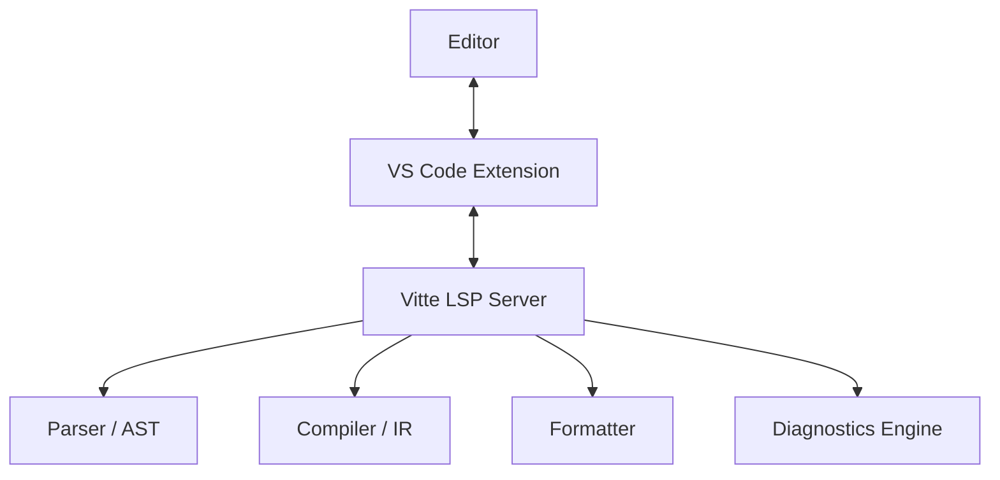

# Vitte LSP — Guide Complet

## Introduction
Le **Language Server Protocol (LSP)** est la passerelle entre Vitte et les éditeurs modernes (VS Code, Neovim, Sublime Text, etc.).  
Le serveur LSP de Vitte (`vitte-lsp`) offre des fonctionnalités de productivité telles que l’autocomplétion, la navigation, le diagnostic en temps réel et le formatage automatique.

---

## Objectifs
- Offrir une **expérience IDE moderne** pour Vitte.
- Standardiser la communication via le protocole **LSP 3.x**.
- Permettre une **intégration multi-éditeurs**.
- Servir de **backend centralisé** pour tous les outils de développement.

---

## Installation

### Depuis les sources
```bash
git clone https://github.com/vitte-lang/vitte.git
cd vitte
cargo build --release -p vitte-lsp
```

### Vérifier l’installation
```bash
./target/release/vitte-lsp --version
```

---

## Utilisation

Le serveur est généralement lancé automatiquement par l’éditeur.  
Manuellement, il peut être exécuté en mode `stdio` ou `tcp`.

### Mode stdio (par défaut)
```bash
vitte-lsp
```

### Mode TCP
```bash
vitte-lsp-tcp --port 9257
```

---

## Fonctionnalités supportées

### 1. Diagnostics
- Analyse en temps réel des erreurs de syntaxe et de typage.
- Affichage dans l’éditeur (soulignement rouge, messages contextuels).
- Support des warnings et notes.

### 2. Autocomplétion
- Variables locales
- Fonctions
- Mots-clés du langage
- Imports et modules

### 3. Navigation
- **Go-to-definition** : se déplacer à la déclaration.
- **Find references** : trouver toutes les occurrences.
- **Document symbols** : explorer la structure du fichier.
- **Workspace symbols** : rechercher dans tout le projet.

### 4. Hover
- Affiche la documentation d’un symbole au survol.
- Inclut type, signature et commentaires de docstring.

### 5. Signature Help
- Affiche les arguments attendus lors de l’appel d’une fonction.

### 6. Formatting
- Formatage automatique via `vitte-fmt`.
- Raccourcis clavier intégrés dans VS Code (`Shift+Alt+F`).

### 7. Renaming
- Renommage de symboles avec propagation automatique.

### 8. Code Actions
- Suggestions de corrections rapides (import manquant, variable inutilisée).
- Refactorings de base.

---

## Exemple de Configuration

### VS Code (`settings.json`)
```json
{
  "vitte.lsp.path": "/usr/local/bin/vitte-lsp",
  "vitte.fmt.enable": true,
  "editor.formatOnSave": true,
  "editor.defaultFormatter": "vitte-lang.vitte"
}
```

### Neovim (Lua)
```lua
require('lspconfig').vitte_lsp.setup{
  cmd = {"vitte-lsp"},
  filetypes = {"vit"},
  root_dir = function(fname)
    return vim.fn.getcwd()
  end
}
```

---

## Architecture du LSP



---

## Intégration CLI

Le serveur peut être démarré via `vitte-cli` :
```bash
vitte lsp
```
Options :
- `--stdio` (par défaut)
- `--tcp <port>`

---

## Exemples d’utilisation

### Hover sur une fonction
```vit
fn add(x: int, y: int) -> int {
    return x + y
}

let z = add(1, 2)
```
Au survol de `add`, l’éditeur affiche :
```
fn add(x: int, y: int) -> int
```

### Renommer une variable
Avant :
```vit
let result = compute()
print(result)
```
Après renommage en `value` :
```vit
let value = compute()
print(value)
```

---

## Débogage

Activer les logs :
```bash
RUST_LOG=debug vitte-lsp
```

Fichier de log :
- Linux : `~/.cache/vitte/lsp.log`
- macOS : `~/Library/Logs/Vitte/lsp.log`
- Windows : `%APPDATA%\Vitte\lsp.log`

---

## Roadmap LSP
- [x] Diagnostics de base
- [x] Autocomplétion
- [x] Hover, Go-to, Find References
- [x] Formatage
- [ ] Refactorings avancés
- [ ] Suggestions automatiques de types
- [ ] Intégration avec `vitte-fuzz`
- [ ] Debug Adapter Protocol (DAP)

---

## Conclusion
Le serveur **LSP Vitte** est l’élément clé pour offrir une expérience moderne et productive.  
Il permet de **développer Vitte comme un langage de premier plan**, avec un IDE complet, multiplateforme et extensible.