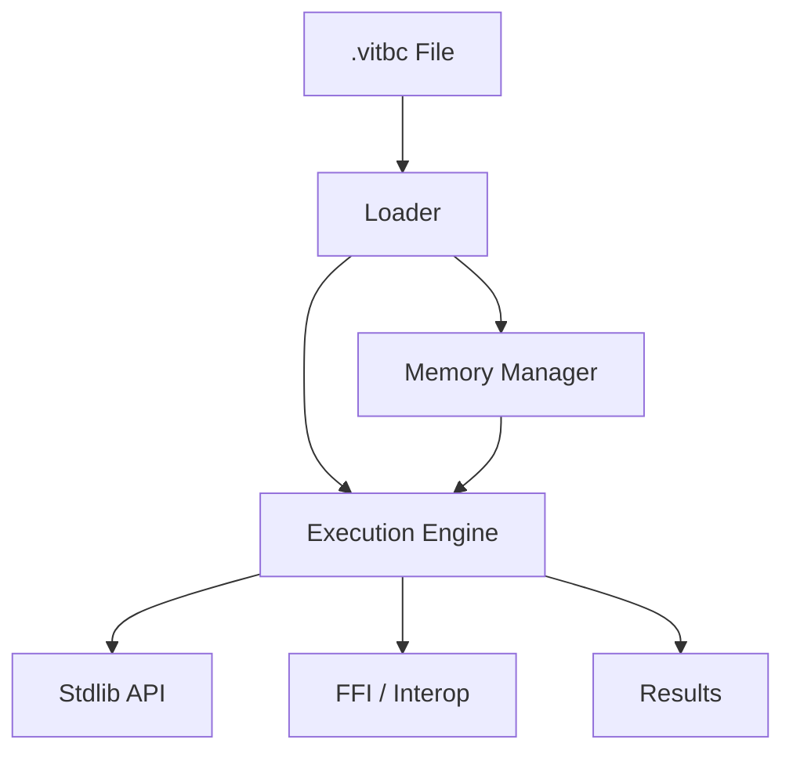

# Vitte Runtime — Overview

## Introduction
Le **runtime Vitte** est le cœur de l’exécution des programmes compilés en **VITBC (Vitte ByteCode)**.  
Il combine la **Virtual Machine (VM)**, la gestion mémoire, les bibliothèques standard de base, et les mécanismes d’interopérabilité.  
Sa conception est guidée par trois principes : **performance**, **portabilité** et **robustesse**.

---

## Objectifs
- Fournir une **machine virtuelle portable** et légère.
- Assurer une **exécution sécurisée** avec gestion stricte des erreurs.
- Offrir des **API natives** minimales (I/O, math, strings, collections).
- Permettre l’**interopérabilité** avec du code natif (C, Rust, etc.).
- Rester **extensible** pour accueillir de futurs modules (GC avancé, JIT, WASM backend).

---

## Composants du Runtime

### 1. Loader
- Charge un fichier `.vitbc`
- Vérifie l’intégrité via **CRC32**
- Décompresse (option **zstd**)
- Construit les tables internes (constantes, fonctions, données)

### 2. Memory Manager
- **Pile (stack)** : exécution des fonctions et variables locales
- **Tas (heap)** : allocation dynamique
- **Registres** : stockage temporaire rapide
- **Garbage Collector (GC)** :
  - Phase actuelle : comptage de références
  - Roadmap : GC mark & sweep, générations

### 3. Execution Engine
- **Interpreter Loop** :
  - Décodage et exécution instruction par instruction
  - Gestion des sauts, appels, retours
- **Opcodes supportés** :
  - Arithmétique : `ADD`, `SUB`, `MUL`, `DIV`
  - Logique : `AND`, `OR`, `NOT`
  - Contrôle : `JUMP`, `IF`, `RETURN`
  - Mémoire : `LOAD`, `STORE`, `ALLOC`
  - Fonctions : `CALL`, `RETURN`
- **Debug Mode** :
  - Trace des instructions
  - Inspection des registres et de la pile

### 4. Standard Library (Runtime API)
- **Strings** : concat, length, substring
- **Collections** : listes, dictionnaires (prévu)
- **I/O** : print, read, fichiers
- **Math** : sin, cos, pow, sqrt
- **System** : horloge, random, args

### 5. Interop / FFI
- Chargement dynamique de fonctions externes
- Liaison avec bibliothèques C/Rust
- Exemple :
```vit
extern fn c_sqrt(x: float) -> float
```

---

## Exemple d’Exécution

### Code source
```vit
fn add(x: int, y: int) -> int {
    return x + y
}

print(add(2, 3))
```

### Bytecode (simplifié)
```text
FUNC add(x, y)
  LOAD_ARG r1, x
  LOAD_ARG r2, y
  ADD r3, r1, r2
  RETURN r3
END

MAIN
  LOAD_CONST r0, 2
  LOAD_CONST r1, 3
  CALL add, r0, r1
  PRINT r0
END
```

### Exécution
```
VM Start
> LOAD_CONST r0, 2
> LOAD_CONST r1, 3
> CALL add
> RETURN r3 (5)
> PRINT 5
VM End
```

---

## Architecture du Runtime



---

## Debug & Outils

### Commandes CLI
```bash
# Exécution normale
vitte exec program.vitbc

# Exécution avec debug
vitte exec program.vitbc --log trace --dump-vm
```

### Fonctionnalités debug
- Trace pas à pas
- Inspection mémoire
- Dumps de pile et registres
- Détection des fuites mémoire (future)

---

## Roadmap Runtime
- [x] Loader + vérification CRC32
- [x] Interpréteur basique
- [x] Pile, tas, registres
- [x] Stdlib minimale
- [ ] Garbage Collector avancé
- [ ] Support JIT (LLVM/Cranelift)
- [ ] Debug Adapter Protocol (DAP)
- [ ] Intégration WebAssembly

---

## Conclusion
Le **runtime Vitte** est conçu pour être minimal, robuste et extensible.  
Il fournit les fondations nécessaires pour exécuter efficacement du bytecode VITBC, tout en ouvrant la voie à des extensions futures (JIT, WASM, FFI avancé).