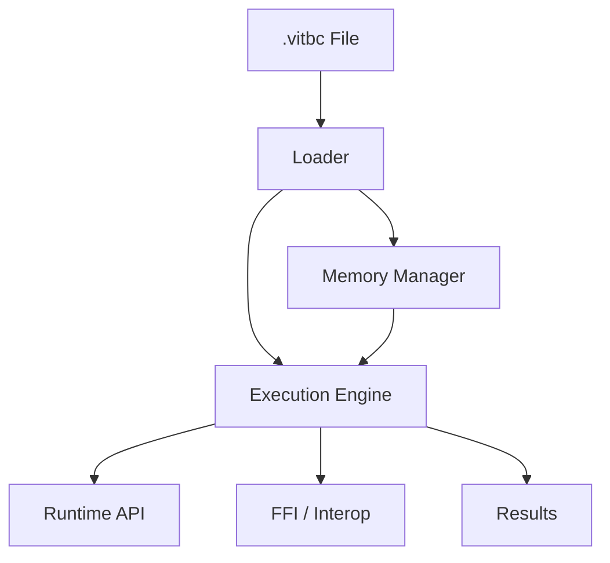

# Vitte Virtual Machine — Overview

## Introduction
La **Virtual Machine (VM)** de Vitte est le moteur d’exécution du bytecode **VITBC**.  
Elle est conçue pour être **portable**, **rapide** et **robuste**, tout en restant simple à comprendre et à maintenir.  
Son rôle est de transformer un fichier `.vitbc` en exécution concrète, en gérant **mémoire, registres et instructions**.

---

## Objectifs
- Exécuter efficacement le bytecode VITBC
- Garantir la portabilité entre plateformes (Linux, Windows, macOS, BSD, RISC-V, WASM)
- Fournir un environnement sûr et isolé
- Supporter **debug, introspection et extensions futures**
- Servir de base pour un futur **JIT** ou backend LLVM

---

## Architecture de la VM

### 1. Loader
- Charge un fichier `.vitbc`
- Vérifie l’intégrité via CRC32
- Décompresse si nécessaire (zstd)
- Reconstruit les tables internes (constantes, fonctions, données)

### 2. Memory Model
- **Pile (stack)** : variables locales, appels de fonctions
- **Tas (heap)** : allocations dynamiques
- **Registres** : stockage rapide pour opérations temporaires
- **Garbage Collector (GC)** :
  - Actuel : comptage de références
  - Futur : mark & sweep, générations

### 3. Execution Engine
- **Boucle d’interprétation (fetch-decode-execute)**
- Opcodes supportés :
  - Arithmétique : `ADD`, `SUB`, `MUL`, `DIV`
  - Logique : `AND`, `OR`, `NOT`
  - Contrôle : `JUMP`, `IF`, `RETURN`
  - Mémoire : `LOAD`, `STORE`, `ALLOC`
  - Fonctions : `CALL`, `RETURN`
- **Mode debug** :
  - Trace des instructions
  - Inspection de la pile et des registres

### 4. Runtime API
- Primitives de base (I/O, math, strings, system)
- Liaison directe avec la stdlib
- Interface stable entre VM et environnement

### 5. Interop / FFI
- Liaison avec bibliothèques externes (C, Rust…)
- Appel de fonctions natives

Exemple :
```vit
extern fn c_sqrt(x: float) -> float
```

---

## Exemple d’Exécution

### Code source
```vit
fn add(x: int, y: int) -> int {
    return x + y
}

print(add(2, 3))
```

### Bytecode simplifié
```text
FUNC add(x, y)
  LOAD_ARG r1, x
  LOAD_ARG r2, y
  ADD r3, r1, r2
  RETURN r3
END

MAIN
  LOAD_CONST r0, 2
  LOAD_CONST r1, 3
  CALL add, r0, r1
  PRINT r0
END
```

### Trace d’exécution
```
VM Start
> LOAD_CONST r0, 2
> LOAD_CONST r1, 3
> CALL add
> RETURN r3 (5)
> PRINT 5
VM End
```

---

## Architecture — Schéma



---

## Debug et Outils

### Commandes CLI
```bash
vitte exec program.vitbc
vitte exec program.vitbc --dump-vm --log trace
```

### Fonctionnalités debug
- Trace pas à pas
- Dumps mémoire
- Inspection pile et registres
- Détection de fuites mémoire (future)

---

## Roadmap VM
- [x] Loader `.vitbc`
- [x] Interpréteur basique
- [x] Pile, tas, registres
- [x] Mode debug
- [ ] Garbage Collector avancé
- [ ] JIT (LLVM / Cranelift)
- [ ] Debug Adapter Protocol (DAP)
- [ ] Backend WebAssembly
- [ ] Sandbox renforcée pour sécurité

---

## Conclusion
La **Virtual Machine Vitte** est le cœur de l’écosystème.  
Elle combine **simplicité et efficacité**, et fournit les bases nécessaires pour exécuter le bytecode de manière sûre et portable.  
Son design modulaire ouvre la voie vers des optimisations futures (**JIT, WASM, FFI avancé**) tout en restant fidèle à la philosophie de Vitte : **clarté, robustesse, extensibilité**.